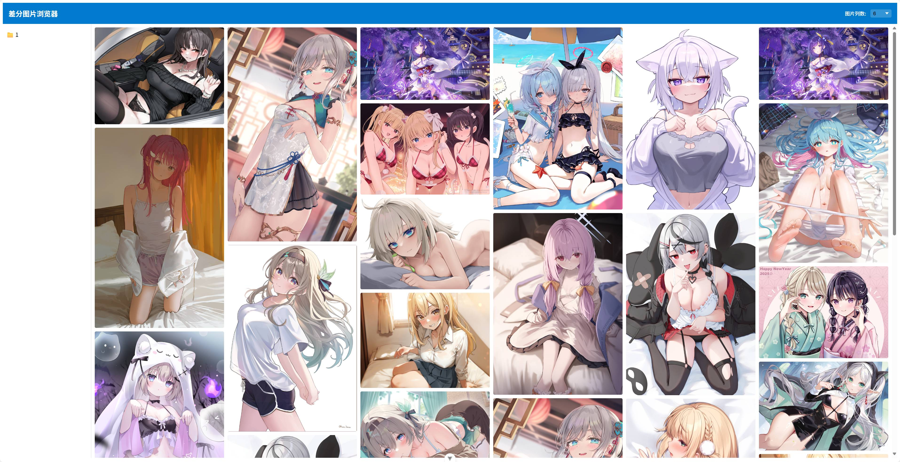
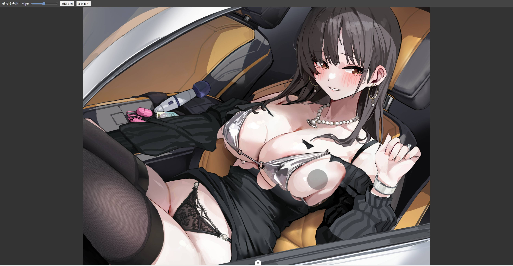
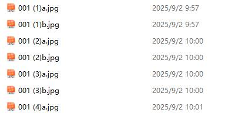

# 差分图片浏览器 (Diff Image Viewer)

差分图片浏览器是一款轻量、易用的图片对比工具，可以快速浏览指定文件夹中的图片，并通过“擦除式”效果，将两张图片重叠显示，直观查看差异。非常适合图片比对、差异分析场景。

---

## 功能预览

### 1. 文件浏览功能
可以方便地浏览指定目录下的图片文件。  



### 2. 图片差分功能
通过“擦除”操作查看两张图片的差异，支持调整橡皮擦大小，实时显示差异区域。  



---

## 使用方法（即开即用）

### 1. 准备文件
- 下载以下文件并放在同一目录下：
  - `Diff-Image-Viewer.exe`
  - `config.ini`

### 2. 配置
- 打开 `config.ini`，根据需要修改配置项。

### 3. 启动程序
- 双击 `Diff-Image-Viewer.exe` 启动程序。
- 打开浏览器访问 [http://localhost:8000/](http://localhost:8000/) 即可使用。


### 1. 配置图片目录
在 `backend/my_config.py` 中修改 `ROOT_DIR` 为你想浏览的图片文件夹，修改`THUMB_DIR`为指定的缩略图生成文件夹：  

```
ROOT_DIR = Path(r"D:\AI-Photo\素材\diff").resolve() # 图片根目录
THUMB_DIR = Path(r"D:\AI-Photo\thumbnails").resolve() # 缩略图生成目录
PASSWORD = "12345678" # 登录密码
generator = ImageGenerator(
    server_address="127.0.0.1:8180", # comfyUI的地址
    input_node="203", # 图片输入节点ID
    output_node="794", # 图片输出节点ID
    noise_nodes=["736", "555"], # 噪声节点ID
)
```
### 2. 执行图片压缩
切换到 backend 文件夹并执行`resize.py`：

### 3. 安装前端依赖
先安装nodejs，然后切换到 frontend 文件夹并执行：
```
npm install
```

### 4. 安装 Python 依赖
切换到backend文件夹，在 Python 环境中执行：
```
pip install -r requirements.txt
```

### 5. 启动程序
切换到项目根目录，在 Python 环境中执行：
```
python start_all.py
```
访问
```http://localhost:5173/```
即可打开应用

## ！！！特别注意！！！
本仅能识别成对的差分图片，文件名需分别为 XXX+a.jpg 和 XXX+b.jpg，成对的两张图片文件在同一级目录下。如有特殊需求，可根据实际情况自行修改代码实现。
示例：



## 功能更新
### V1.0
1. 新增一键切换a、b图片的功能；
2. 修正了外网访问被拒绝的bug；
3. 采用缩略图加载模式以提升速度
### V1.1
1. 适配移动端；
2. 修正了一些界面上的显示bug；
### V1.2
新增重新生成b图功能，通过comfyui的API实现。注意：该工作流必须已经在comfyui中可用，才能调用API出图；
### V1.3
1. 增加省流模式；
2. 增加透视模式；
3. 修改主页菜单；
4. 增加生成缩略图的调用；
### V1.4
1. 新增登录密码
2. 优化使用体验
### V1.5
1. 打包文件，即开即用；
2. 修改了部分API（可能有遗留bug，如果有发现麻烦提交issue）